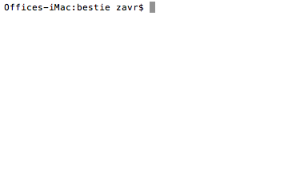
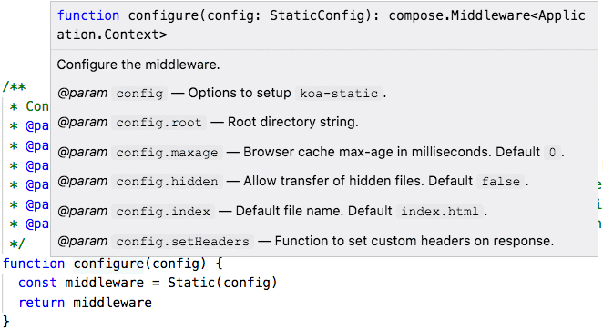
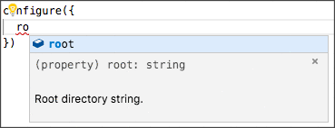
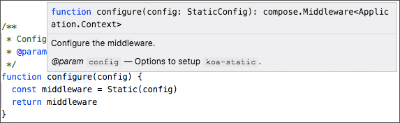
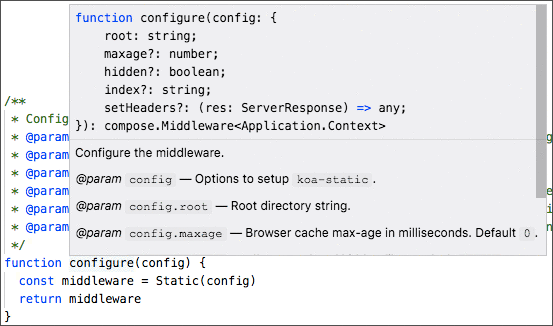
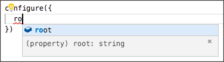

# documentary

[](https://npmjs.org/package/documentary)

`documentary` is a command-line tool and a library to manage documentation of Node.js packages. Due to the fact that complex `README` files are harder to maintain, `documentary` serves as a pre-processor of documentation.

```sh
yarn add -DE documentary
```

## Table Of Contents

- [Table Of Contents](#table-of-contents)
- [Installation & Usage](#installation--usage)
- [Features](#features)
  * [TOC Generation](#toc-generation)
    * [TOC Titles](#toc-titles)
      * [Specific Level](#specific-level)
  * [Tables Display](#tables-display)
  * [Method Title](#method-title)
    * [`async runSoftware(path: string, config: Config): string`](#async-runsoftwarepath-stringconfig-view-containeractions-objectstatic-boolean--truerender-function-string)
    * [`async runSoftware(path: string)`](#async-runsoftwarepath-string-void)
    * [`runSoftware(): string`](#runsoftware-string)
  * [Comments Stripping](#comments-stripping)
  * [File Splitting](#file-splitting)
  * [Replacement Rules](#replacement-rules)
    * [`%NPM: package-name%`](#npm-package-name)
    * [`%TREE directory ...args%`](#tree-directory-args)
    * [`%FORK(-lang)? module ...args%`](#fork-lang-module-args)
  * [Examples Placement](#examples-placement)
  * [Gif Detail](#gif-detail)
    * [<code>yarn doc</code>](#yarn-doc)
  * [`Type` Definition](#type-definition)
    * [Dedicated Example Row](#dedicated-example-row)
  * [`@typedef` Organisation](#typedef-organisation)
    * [JS Placement](#js-placement)
      * [Expanded `@param`](#expanded-param)
      * [Spread `@param`](#spread-param)
    * [README placement](#readme-placement)
      * [`SetHeaders`](#setheaders)
      * [`StaticConfig`](#staticconfig)
    * [Importing Types](#importing-types)
    * [XML Schema](#xml-schema)
    * [Migration](#migration)
- [CLI](#cli)
  * [Output Location](#output-location)
  * [Only TOC](#only-toc)
  * [Generate Types](#generate-types)
  * [Extract Types](#extract-types)
  * [Watch Mode](#watch-mode)
  * [Automatic Push](#automatic-push)
  * [`NODE_DEBUG=doc`](#node_debugdoc)
- [API](#api)
  * [`Toc` Stream](#toc-stream)
  * [`TocConfig` Type](#tocconfig-type)
    * [<code>skipLevelOne</code>](#skiplevelone)
  * [`constructor(config?: TocConfig): Toc`](#constructorconfig-skiplevelone-boolean--true-toc)
- [Glossary](#glossary)
  * [Online Documentation](#online-documentation)
  * [Editor Documentation](#editor-documentation)
- [Copyright](#copyright)

## Installation & Usage

The `doc` client is available after installation. It can be used in a `doc` script of `package.json`, as follows:

```json
{
  "scripts": {
    "doc": "doc documentary -o README.md"
  }
}
```

The first argument, `documentary` is a path to a directory containing source documentation files, or a path to a single file to be processed, e.g., `README-source.md`.

Therefore, to produce an output `README.md`, the following command will be used:

```sh
yarn doc
```

When actively working on documentation, it is possible to use the `watch` mode with `-w` flag, or `-p` flag to also automatically push changes to a remote git repository, merging them into a single commit every time.
## Features

The processed `README.md` file will have a generated table of contents, markdown tables and neat titles for API method descriptions, as well as other possible features described in this section.
### TOC Generation

Table of contents are useful for navigation the README document. When a `%TOC%` placeholder is found in the file, it will be replaced with an extracted structure. Titles appearing in comments and code blocks will be skipped.

```md
- [Table Of Contents](#table-of-contents)
- [CLI](#cli)
  * [`-j`, `--jsdoc`: Add JSDoc](#-j---jsdoc-add-jsdoc)
- [API](#api)
- [Copyright](#copyright)
```

#### TOC Titles

To be able to include a link to a specific position in the text (i.e., create an "anchor"), `documentary` supports a `TOC Titles` feature. Any text written as `[Toc Title](t)` will generate a relevant position in the table of contents. It will automatically detect the appropriate level and be contained inside the current section.

This feature can be useful when presenting some data in a table in a section, but wanting to include a link to each row in the table of contents so that the structure is immediately visible.

**<a name="specific-level">Specific Level</a>**: if required, the level can be specified with a number of `#` symbols, such as `[Specific Level](######)`.
### Tables Display

To describe method arguments in a table, but prepare them in a more readable format, `documentary` will parse the code blocks with `table` language as a table. The blocks must be in `JSON` format and contain a single array of arrays which represent rows.

````m
```table
[
  ["arg", "description"],
  ["-f", "Display only free domains"],
  ["-z", "A list of zones to check"],
]
```
````

Result:

| arg | description |
| --- | ----------- |
| -f | Display only free domains |
| -z | A list of zones to check |
### Method Title

It is possible to generate neat titles useful for API documentation with `documentary`. The method signature should be specified as a `JSON` array, where every member is an argument specified as an array. The first item in the argument array is the argument name, and the second one is type. Type can be either a string, or an object. If it is an object, each value in the object will be an array and first contain the property type, secondly - the default value. To mark a property as optional, the `?` symbol can be used at the end. The third item is the short name for the table of contents (so that a complex object can be referenced to its type).

#### `async runSoftware(`<br/>&nbsp;&nbsp;`path: string,`<br/>&nbsp;&nbsp;`config: {`<br/>&nbsp;&nbsp;&nbsp;&nbsp;`View: Container,`<br/>&nbsp;&nbsp;&nbsp;&nbsp;`actions: object,`<br/>&nbsp;&nbsp;&nbsp;&nbsp;`static?: boolean = true,`<br/>&nbsp;&nbsp;&nbsp;&nbsp;`render?: function,`<br/>&nbsp;&nbsp;`},`<br/>`): string`

Generated from

````m
```#### async runSoftware => string
[
  ["path", "string"],
  ["config", {
    "View": ["Container"],
    "actions": ["object"],
    "static?": ["boolean", true],
    "render?": ["function"]
  }, "Config"]
]
```
````

#### `async runSoftware(`<br/>&nbsp;&nbsp;`path: string,`<br/>`): void`

Generated from

````m
```#### async runSoftware
[
  ["path", "string"]
]
```
````

#### `runSoftware(): string`

Generated from

````m
```#### runSoftware => string
```
````
### Comments Stripping

Since comments found in `<!-- comment -->` sections are not visible to users, they will be removed from the output document.
### File Splitting

`documentary` can read a directory and put files together into a single `README` file. The files will be sorted in alphabetical order, and their content merged into a single stream. The `index.md` and `footer.md` are special in this respect, so that the `index.md` of a directory will always go first, and the `footer.md` will go last.

Example structure used in this project:

```m
documentary
├── 1-installation-and-usage
│   ├── 1-vs-code.md
│   └── index.md
├── 2-features
│   ├── 1-TOC-generation.md
│   ├── 2-table-display.md
│   ├── 3-method-title.md
│   ├── 4-comment-stripping.md
│   ├── 5-file-splitting.md
│   ├── 6-rules.md
│   ├── 7-examples.md
│   ├── 8-gif.md
│   ├── 9-type.md
│   ├── 91-typedef
│   │   ├── 1-js.md
│   │   ├── 2-readme.md
│   │   ├── 3-imports.md
│   │   ├── 4-schema.md
│   │   ├── 9-migration.md
│   │   └── index.md
│   └── index.md
├── 3-cli.md
├── 4-api
│   ├── 1-toc.md
│   └── index.md
├── footer.md
└── index.md
```
### Replacement Rules

There are some built-in rules for replacements.

| Rule | Description |
| ---- | ----------- |
| <a name="npm-package-name">`%NPM: package-name%`</a> | Adds an NPM badge, e.g., `[![npm version] (https://badge.fury.io/js/documentary.svg)] (https://npmjs.org/package/documentary)` |
| <a name="tree-directory-args">`%TREE directory ...args%`</a> | Executes the `tree` command with the given arguments. If `tree` is not installed, warns and does not replace the match. |
| <a name="fork-lang-module-args">`%FORK(-lang)? module ...args%`</a> | Forks the Node.js process to execute the module using `child_process.fork`. The output is printed in the code block, with optionally given language. For example: `%FORK-json example.js -o%` |
### Examples Placement

`documentary` can be used to embed examples into the documentation. The example file needs to be specified with the following marker:

```
%EXAMPLE: examples/example.js, ../src => documentary%
```

The first argument is the path to the example relative to the working directory of where the command was executed (normally, the project folder). The second optional argument is the replacement for the `import` statements. The third optional argument is the markdown language to embed the example in and will be determined from the example extension if not specified.

Given the documentation section:

```md
## API Method

This method allows to generate documentation.

%EXAMPLE: examples/example.js, ../src => documentary, javascript%`
```

And the example file `examples/example.js`

```js
import documentary from '../src'
import Catchment from 'catchment'

(async () => {
  await documentary()
})()
```

The program will produce the following output:

````
## API Method

This method allows to generate documentation.

```javascript
import documentary from 'documentary'
import Catchment from 'catchment'

(async () => {
  await documentary()
})()
```
````
### Gif Detail

The `GIF` rule will inserts a gif animation inside of a `<detail>` block. To highlight the summary with background color, `<code>` should be used instead of back-ticks. [TOC title link](##toc-titles) also work inside the summary.

```
%GIF doc/doc.gif
Alt: Generating documentation.
Click to View: [<code>yarn doc</code>](t)
%
```

<details>
  <summary>Click to View: <a name="yarn-doc"><code>yarn doc</code></a></summary>
  <table>
  <tr><td>
    
  </td></tr>
  </table>
</details>
<br>

The actual html placed in the `README` looks like the one below:

```html
<details>
  <summary>Summary of the detail: <code>yarn doc</code></summary>
  <table>
  <tr><td>
    
  </td></tr>
  </table>
</details>
```

### `Type` Definition

Often, it is required to document a type of an object, which methods can use. To display the information about type's properties in a table, the `TYPE` macro can be used. It allows to show all possible properties that an object can contain, show which ones are required, give examples and link them in the table of contents (disabled by default).

Its signature is as follows:

```xml
%TYPE addToToc(true|false)
<p name="propertyName" type="propertyType" required>
  <d>Property Description.</d>
  <d>Property Example.</d>
</p>
%
```

For example,

````xml
%TYPE
<p name="text" type="string" required>
  <d>Display text. Required.</d>
  <e>

```js
const q = {
  text: 'What is your name',
}
```
  </e>
</p>
<p name="validation" type="(async) function">
  <d>A function which needs to throw an error if validation does not pass.</d>
  <e>

```js
const q = {
  text: 'What is your name',
  validate(v) {
    if (!v.length) throw new Error('Name is required.')
  },
}
```
  </e>
</p>
%
````

will display the following table:

<table>
 <thead>
  <tr>
   <th>Property</th>
   <th>Type</th>
   <th>Description</th>
   <th>Example</th>
  </tr>
 </thead>
 <tbody>
  <tr>
   <td><strong><code>text*</code></strong></td>
   <td><em>string</em></td>
   <td>Display text. Required.</td>
   <td>

```js
const q = {
  text: 'What is your name',
}
```
  </td>
  </tr>
  <tr>
   <td><code>validation</code></td>
   <td><em>(async) function</em></td>
   <td>A function which needs to throw an error if validation does not pass.</td>
   <td>

```js
const q = {
  text: 'What is your name',
  validate(v) {
    if (!v.length) throw new Error('Name is required.')
  },
}
```
  </td>
  </tr>
 </tbody>
</table>


When required to use the markdown syntax in tables (such as `__`, links, _etc_), an extra space should be left after the `d` or `e` tags like so:

```xml
%TYPE true
<p name="skipLevelOne" type="boolean">
  <d>

Start the table of contents from level 2, i.e., excluding the `#` title.</d>
</p>
%
```

Otherwise, the content will not be processed by `GitHub`. However, it will add an extra margin to the content of the cell as it will be transformed into a paragraph.

#### Dedicated Example Row

Because examples occupy a lot of space which causes table squeezing on GitHub and scrolling on NPM, `documentary` allows to dedicate a special row to an example. It can be achieved by adding a `row` attribute to the `e` element, like so:

````xml
%TYPE
<p name="headers" type="object">
  <d>Incoming headers returned by the server.</d>
  <e row>

```json
{
  "server": "GitHub.com",
  "content-type": "application/json",
  "content-length": "2",
  "connection": "close",
  "status": "200 OK"
}
```
  </e>
</p>
%
````

In addition, any properties which do not contain examples will not have an example column at all.

<table>
 <thead>
  <tr>
   <th>Property</th>
   <th>Type</th>
   <th>Description</th>
   <th>Example</th>
  </tr>
 </thead>
 <tbody>
  <tr>
   <td><code>body</code></td>
   <td><em>string|object|Buffer</em></td>
   <td colspan="2">The return from the server.</td>
  </tr>
  <tr>
   <td><code>headers</code></td>
   <td><em>object</em></td>
   <td colspan="2">Incoming headers returned by the server.</td>
  </tr>
  <tr></tr>
  <tr>
   <td colspan="4">

```json
{
  "server": "GitHub.com",
  "content-type": "application/json",
  "content-length": "2",
  "connection": "close",
  "status": "200 OK"
}
```
  </td>
  </tr>
  <tr>
   <td><code>statusCode</code></td>
   <td><em>number</em></td>
   <td>The status code returned by the server.</td>
   <td><code>200</code></td>
  </tr>
 </tbody>
</table>


Finally, when no examples which are not rows are given, there will be no `Example` heading.

````xml
%TYPE
<p name="data" type="object">
  <d>Optional data to send to the server with the request.</d>
  <e row>

```js
{
  name: 'test',
}
```
  </e>
</p>
<p name="method" type="string">
  <d>What HTTP method to use to send data (only works when <code>data</code> is set).</d>
</p>
%
````

<table>
 <thead>
  <tr>
   <th>Property</th>
   <th>Type</th>
   <th>Description</th>
  </tr>
 </thead>
 <tbody>
  <tr>
   <td><code>data</code></td>
   <td><em>object</em></td>
   <td>Optional data to send to the server with the request.</td>
  </tr>
  <tr></tr>
  <tr>
   <td colspan="3">

```js
{
  name: 'test',
}
```
  </td>
  </tr>
  <tr>
   <td><code>method</code></td>
   <td><em>string</em></td>
   <td>What HTTP method to use to send data (only works when <code>data</code> is set).</td>
  </tr>
 </tbody>
</table>


### `@typedef` Organisation

For the purpose of easier maintenance of _JSDoc_ `@typedef` declarations, `documentary` allows to keep them in a separate XML file, and then place compiled versions into both source code as well as documentation. By doing this, more flexibility is achieved as types are kept in one place but can be reused for various purposes across multiple files. It is different from _TypeScript_ type declarations as `documentary` will generate _JSDoc_ comments rather than type definitions which means that a project does not have to be written in _TypeScript_.

Types are kept in a separate `xml` file, for example:

```xml
<types>
  <import name="ServerResponse" from="http" />
  <type name="SetHeaders"
    type="(res: ServerResponse) => any"
    desc="Function to set custom headers on response." />
  <type name="StaticConfig" desc="Options to setup `koa-static`.">
    <prop string name="root">
      Root directory string.
    </prop>
    <prop number name="maxage" default="0">
      Browser cache max-age in milliseconds.
    </prop>
    <prop boolean name="hidden" default="false">
      Allow transfer of hidden files.
    </prop>
    <prop string name="index" default="index.html">
      Default file name.
    </prop>
    <prop opt type="SetHeaders" name="setHeaders">
      Function to set custom headers on response.
    </prop>
  </type>
</types>
```

They are then included in both JavaScript source code and markdown documentation.

#### JS Placement

To include a compiled declaration into a source code, the following line should be placed in the `.js` file (where the `types/static.xml` file exists in the project directory from which the `doc` command will be run):

```js
/* documentary types/static.xml */
```

For example, an unprocessed _JavaScript_ file can look like this:

```js
/* src/config-static.js */
import Static from 'koa-static'

/**
 * Configure the middleware.
 */
function configure(config) {
  const middleware = Static(config)
  return middleware
}

/* documentary types/static.xml */

export default configure
```

> Please note that the types marker must be placed before `export default` is done (or just `export`) as there's currently a bug in VS Code.

The file is then processed with [`doc src/config-static.js -g`](#generate-types) command and updated in place, unless `-` is given as an argument, which will print the output to _stdout_, or the path to the output file is specified. After the processing is done, the source code will be transformed to include all types specified in the XML file. This routine can be repeated whenever types are updated (unless the [`spread`](#spread-param) attribute was set, when the generated _JSDoc_ of a function has to be removed by hand first).

```js
/* src/config-static.js */
import Static from 'koa-static'

/**
 * Configure the middleware.
 */
function configure(config) {
  const middleware = Static(config)
  return middleware
}

/* documentary types/static.xml */
/**
 * @typedef {import('http').ServerResponse} ServerResponse
 *
 * @typedef {(res: ServerResponse) => any} SetHeaders Function to set custom headers on response.
 *
 * @typedef {Object} StaticConfig Options to setup `koa-static`.
 * @prop {string} root Root directory string.
 * @prop {number} [maxage=0] Browser cache max-age in milliseconds. Default `0`.
 * @prop {boolean} [hidden=false] Allow transfer of hidden files. Default `false`.
 * @prop {string} [index="index.html"] Default file name. Default `index.html`.
 * @prop {SetHeaders} [setHeaders] Function to set custom headers on response.
 */

export default configure
```

##### Expanded `@param`

In addition, _JSDoc_ for any method that has an included type as one of its parameters will be updated to its expanded form so that a preview of options is available.

Therefore, a raw function _JSDoc_ of a function written as

```js
/**
 * Configure the middleware.
 * @param {StaticConfig} config Options to setup `koa-static`.
 */
function configure(config) {
  const middleware = Static(config)
  return middleware
}
```

will be expanded to include the properties of the type:

```js
/**
 * Configure the middleware.
 * @param {StaticConfig} config Options to setup `koa-static`.
 * @param {string} config.root Root directory string.
 * @param {number} [config.maxage=0] Browser cache max-age in milliseconds. Default `0`.
 * @param {boolean} [config.hidden=false] Allow transfer of hidden files. Default `false`.
 * @param {string} [config.index="index.html"] Default file name. Default `index.html`.
 * @param {SetHeaders} [config.setHeaders] Function to set custom headers on response.
 */
function configure(config) {
  const middleware = Static(config)
  return middleware
}
```

This makes it possible to see the properties of the argument to the `configure` function fully:



And the description of each property will be available when passing an argument to the function:



Compare that to the preview without _JSDoc_ expansion:



To prevent the expansion, the `noExpand` attribute should be added to the type.

##### Spread `@param`

Moreover, when the type of the type is just object, it also can be spread into a notation which contains its properties for even better visibility. To do that, the `spread` attribute must be added to the type definition in the `xml` file.

Again, a raw function with JSDoc:

```js
/**
 * Configure the middleware.
 * @param {StaticConfig} config Options to setup `koa-static`.
 */
function configure(config) {
  const middleware = Static(config)
  return middleware
}
```

Can be re-written as spread notation of a type.

```js
/**
 * Configure the middleware.
 * @param {{ root: string, maxage?: number, hidden?: boolean, index?: string, setHeaders?: SetHeaders }} config Options to setup `koa-static`.
 * @param {string} config.root Root directory string.
 * @param {number} [config.maxage=0] Browser cache max-age in milliseconds. Default `0`.
 * @param {boolean} [config.hidden=false] Allow transfer of hidden files. Default `false`.
 * @param {string} [config.index="index.html"] Default file name. Default `index.html`.
 * @param {SetHeaders} [config.setHeaders] Function to set custom headers on response.
 */
function configure(config) {
  const middleware = Static(config)
  return middleware
}
```

The properties will be visible in the preview:



However, this method has one disadvantage as there will be no descriptions of the properties when trying to use them in a call to function:



Therefore, it must be considered what is the best for developers -- to see descriptions of properties when passing a configuration object to a function, but not see all possible properties, or to see the full list of properties, but have no visibility of what they mean.

#### README placement

To place a type definition as a table into a `README` file, the `TYPEDEF` snippet can be used, where the first argument is the path to the `xml` file containing definitions, and the second one is the name of the type to embed. Moreover, links to the type descriptions will be created in the table of contents using the [__TOC Titles__](#toc-titles), but to prevent this, the `noToc` attribute should be set for a type.

```
%TYPEDEF path/definitions.xml TypeName%
```

For example, using previously defined `StaticConfig` type from `types/static.xml` file, `documentary` will process the following markers:

```
%TYPEDEF types/static.xml ServerResponse%
%TYPEDEF types/static.xml SetHeaders%
%TYPEDEF types/static.xml StaticConfig%
```

or a single marker to include all types in order in which they appear in the `xml` file (doing this also allows to reference other types from properties):

```
%TYPEDEF types/static.xml%
```

and embed resulting type definitions:

`import('http').ServerResponse` __`ServerResponse`__

`(res: ServerResponse) => any` __<a name="setheaders">`SetHeaders`</a>__: Function to set custom headers on response.

__<a name="staticconfig">`StaticConfig`</a>__: Options to setup `koa-static`.

| Name | Type | Description | Default |
| ---- | ---- | ----------- | ------- |
| __root*__ | _string_ | Root directory string. | - |
| maxage | _number_ | Browser cache max-age in milliseconds. | `0` |
| hidden | _boolean_ | Allow transfer of hidden files. | `false` |
| index | _string_ | Default file name. | `index.html` |
| setHeaders | [_SetHeaders_](#setheaders) | Function to set custom headers on response. | - |

#### Importing Types

A special `import` element can be used to import a type using _VS Code_'s _TypeScript_ engine. An import is just a typedef which looks like `/** @typedef {import('package').Type} Type */`. This makes it easier to reference the external type later in the file. However, it is not supported in older versions of _VS Code_.

<table>
<thead>
<tr>
<th>Original Source</th>
<th>Types Definition</th>
</tr>
</thead>
<tbody>
<tr/>
<tr><td>

```js
async function example() {
  process.stdout.write('example\n')
}

/* documentary types/import.xml */

export default example
```
</td>
<td>

```xml
<types>
  <import name="IncomingMessage" from="http" />
  <import name="ServerResponse" from="http" />
  <import name="StorageEngine" from="koa-multer" />
  <import name="File" from="koa-multer" />
  <type type="(f: File) => void" name="Function"
    desc="A function to save a file." />
</types>
```
</td>
</tr>
<tr>
<td colspan="2" align="center">
<strong>Output</strong>
</td></tr>
<tr>
<td colspan="2">

```js
async function example() {
  process.stdout.write('example\n')
}

/* documentary types/import.xml */
/**
 * @typedef {import('http').IncomingMessage} IncomingMessage
 * @typedef {import('http').ServerResponse} ServerResponse
 * @typedef {import('koa-multer').StorageEngine} StorageEngine
 * @typedef {import('koa-multer').File} File
 *
 * @typedef {(f: File) => void} Function A function to save a file.
 */

export default example
```
</td>
</tr>
</tbody>
</table>

#### XML Schema

The XML file should have the following nodes and attributes:

<table>
<thead>
 <tr>
  <th>Node</th>
  <th>Description</th>
  <th>Attributes</th>
 </tr>
</thead>
<tbody>
 <tr>
  <td>

_types_</td>
  <td>A single root element.</td>
  <td></td>
 </tr>
 <tr>
  <td>

_import_</td>
  <td>An imported type definition.</th>
  <td>

- _name_: Name of the imported type.</li>
- _from_: The module from which the type is imported.</li>
  </td>
 </tr>
 <tr>
  <td>

_type_</td>
  <td>

A `@typedef` definition.</th>
  <td>

- _name_: A name of the type.</li>
- _desc_: A Description of the type.</li>
- _type_: A type of the type, if different from `Object`.</li>
- _noToc_: Do not include link to the type in the table of contents.</li>
- _spread_: Spread the type to the `{ prop: Type, prop2: Type2 }` notation when used as a `@param`.</li>
- _noExpand_: Do not expand the type when writing as a `@param` in _JSDoc_.</li>
  </td>
 </tr>
 <tr>
  <td>

_prop_</td>
  <td>

Property of a `@typedef` definition.</th>
  <td>

- _name_: Name of the property.</li>
- _string_: Whether the property is string.</li>
- _number_: Whether the property is number.</li>
- _boolean_: Whether the property is boolean.</li>
- _opt_: Whether the property is optional.</li>
- _default_: Default value of the property. When given, the property becomes optional.</li>
  </td>
 </tr>
</tbody>
</table>

#### Migration

A JavaScript file can be scanned for the presence of `@typedef` JSDoc comments, which are then extracted to a `types.xml` file. This can be done with the [`doc src/index.js -e types/index.xml`](#extract-types) command. This is primarily a tool to migrate older software to using `types.xml` files which can be used both for [online documentation](#online-documentation) and [editor documentation](#editor-documentation).

For example, types can be extracted from a JavaScript file which contains JSDoc in form of comments:

```js
async function test() {
  process.stdout.write('ttt')
}

/**
 * @typedef {import('http').IncomingMessage} IncomingMessage
 */

/**
 * @typedef {(m: IncomingMessage)} Test This is test function.
 *
 * @typedef {Object} SessionConfig Description of Session Config.
 * @prop {string} key cookie key.
 * @prop {number|'session'} [maxAge=86400000] maxAge in ms. `session` will result in a cookie that expires when session/browser is closed.
 * @prop {boolean} [overwrite] Can overwrite or not. Default `true`.
 * @prop {boolean} [httpOnly] httpOnly or not or not. Default `true`.
 * @prop {boolean} [renew] Renew session when session is nearly expired, so we can always keep user logged in. Default `false`.
 */


export default test
```

When a description ends with <code>Default &#96;value&#96;</code>, the default value of a type can also be parsed from there.

```xml
<types>
  <import name="IncomingMessage" from="http" />
  <type name="Test" type="(m: IncomingMessage)" desc="This is test function." />
  <type name="SessionConfig" desc="Description of Session Config.">
    <prop string name="key">
      cookie key.
    </prop>
    <prop type="number|'session'" name="maxAge" default="86400000">
      maxAge in ms. `session` will result in a cookie that expires when session/browser is closed.
    </prop>
    <prop boolean name="overwrite" default="true">
      Can overwrite or not.
    </prop>
    <prop boolean name="httpOnly" default="true">
      httpOnly or not or not.
    </prop>
    <prop boolean name="renew" default="false">
      Renew session when session is nearly expired, so we can always keep user logged in.
    </prop>
  </type>
</types>
```
## CLI

The program is used from the CLI (or `package.json` script).

```sh
doc README-source.md [-o README.md] [-tgewp]
```

The arguments it accepts are:

| Flag | Meaning | Description |
| ---- | ------- | ----------- |
| `-o path` | <a name="output-location">Output Location</a> | Where to save the processed `README` file. If not specified, the output is written to the `stdout`. |
| `-t` | <a name="only-toc">Only TOC</a> | Only extract and print the table of contents. |
| `-g [path]` | <a name="generate-types">Generate Types</a> | Insert `@typedef` _JSDoc_ into JavaScript files. When no path is given, the files are updated in place, and when `-` is passed, the output is printed to _stdout_. |
| `-e [path]` | <a name="extract-types">Extract Types</a> | Insert `@typedef` JSDoc into JavaScript files. When no path is given, the files are updated in place, and when `-` is passed, the output is printed to _stdout_. |
| `-w` | <a name="watch-mode">Watch Mode</a> | Watch mode: re-run the program when changes to the source file are detected. |
| `-p "commit message"` | <a name="automatic-push">Automatic Push</a> | Watch + push: automatically push changes to a remote git branch by squashing them into a single commit. |

When <a name="node_debugdoc">`NODE_DEBUG=doc`</a> is set, the program will print debug information, e.g.,

```
DOC 80734: stripping comment
DOC 80734: could not parse the table
```
## API

The programmatic use of the `documentary` is intended for developers who want to use this software in their projects.
### `Toc` Stream

`Toc` is a transform stream which can generate a table of contents for incoming markdown data. For every title that the transform sees, it will push the appropriate level of the table of contents.

### `TocConfig` Type

When creating a new `Toc` instance, it will accept the following configuration object.
<table>
 <thead>
  <tr>
   <th>Property</th>
   <th>Type</th>
   <th>Description</th>
   <th>Example</th>
  </tr>
 </thead>
 <tbody>
  <tr>
   <td><a name="skiplevelone"><code>skipLevelOne</code></a></td>
   <td><em>boolean</em></td>
   <td>Start the table of contents from level 2, i.e., excluding the <code>#</code> title.</td>
   <td>For example, the following code:

```md
# Hello World

## Table Of Contents

## Introduction
```

will be compiled to

```md
- [Table Of Contents](#table-of-contents)
- [Introduction](#introduction)
```

when `skipLevelOne` is not set (by default), and to

```md
- [Hello World](#hello-world)
  * [Table Of Contents](#table-of-contents)
  * [Introduction](#introduction)
```

when `skipLevelOne` is set to `false`.
  </td>
  </tr>
 </tbody>
</table>


### `constructor(`<br/>&nbsp;&nbsp;`config?: {`<br/>&nbsp;&nbsp;&nbsp;&nbsp;`skipLevelOne?: boolean = true,`<br/>&nbsp;&nbsp;`},`<br/>`): Toc`

Create a new instance of a `Toc` stream.

```javascript
/* yarn example/toc.js */
import { Toc } from 'documentary'
import Catchment from 'catchment'
import { createReadStream } from 'fs'

(async () => {
  try {
    const md = createReadStream('example/markdown.md')
    const rs = new Toc()
    md.pipe(rs)

    const { promise } = new Catchment({ rs })
    const res = await promise
    console.log(res)
  } catch ({ stack }) {
    console.log(stack)
  }
})()
```

```fs
- [Table Of Contents](#table-of-contents)
- [CLI](#cli)
  * [`-j`, `--jsdoc`: Add JSDoc](#-j---jsdoc-add-jsdoc)
- [API](#api)
- [Copyright](#copyright)
```

## Glossary

- **<a name="online-documentation">Online Documentation</a>**: documentation which is accessible online, such as on a GitHub website, or a language reference, e.g., [Node.js Documentation](https://nodejs.org/api/stream.html).
- **<a name="editor-documentation">Editor Documentation</a>**: hints available to the users of an IDE, or an editor, in form of suggestions and descriptive hints on hover over variables' names.

## Copyright

(c) [Art Deco][1] 2018

[1]: https://artdeco.bz

